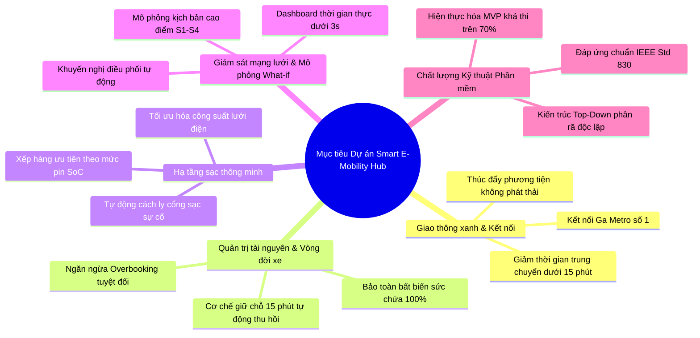
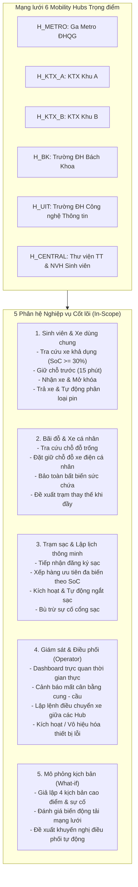
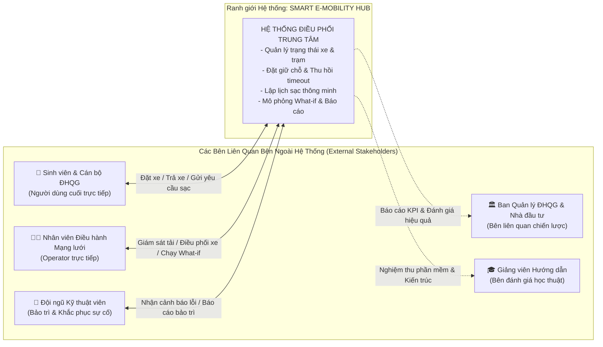
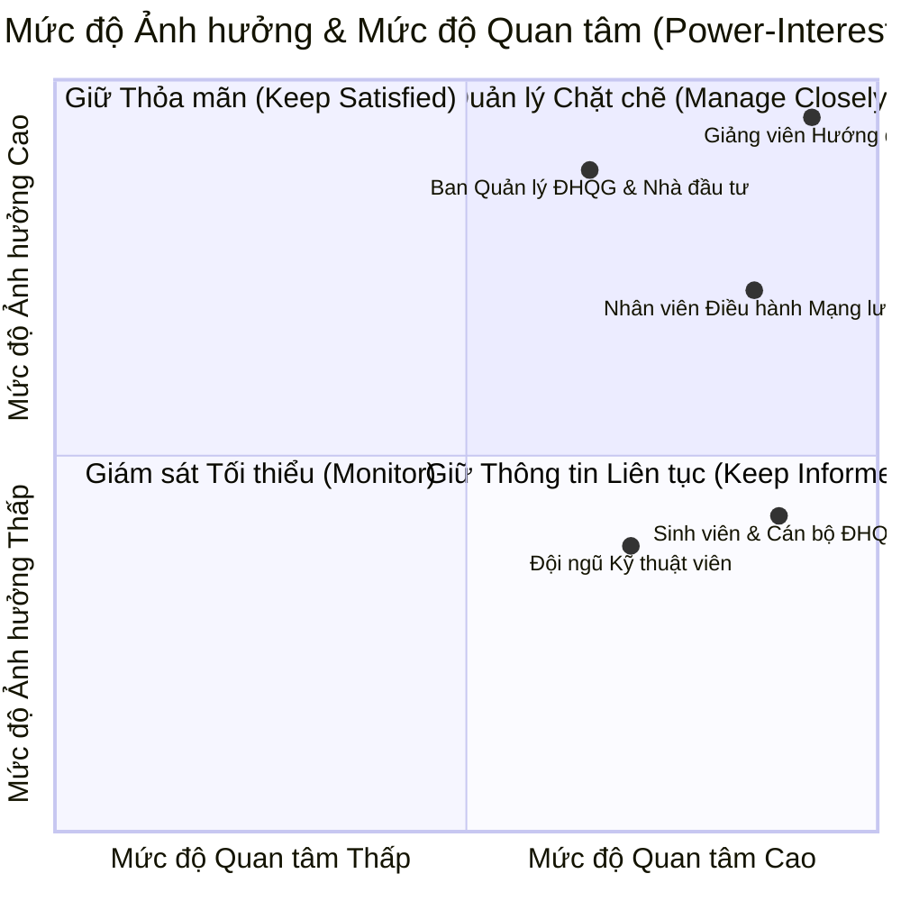

# ĐẶC TẢ CHI TIẾT DỰ ÁN (PROJECT DETAILS SPECIFICATION)
## MÔN HỌC: CÔNG NGHỆ PHẦN MỀM (CO3001) — HỌC KỲ HK261

---

* **Đơn vị đào tạo:** Khoa Khoa học và Kỹ thuật Máy tính — Trường Đại học Bách Khoa, ĐHQG-HCM
* **Lớp:** L02
* **Nhóm thực hiện:** Kẹo Ngọt
* **Giảng viên hướng dẫn:** TS. Trần Thị Ngọc Trâm
* **Tiêu chuẩn tài liệu:** IEEE Std 830-1998, Sommerville Software Engineering (10th Edition)

---

## DANH SÁCH THÀNH VIÊN NHÓM & PHÂN CÔNG VAI TRÒ

| STT | Họ và tên | Mã số sinh viên | Vai trò phụ trách | Phân hệ chuyên trách |
| :---: | :--- | :---: | :--- | :--- |
| 1 | **Nguyễn Tiến Dũng** | 2410609 | Nhóm trưởng / Phân tích hệ thống | Architecture & Core Services |
| 2 | **Lê Nguyễn Nhật Quỳnh** | 2433199 | Thành viên / Kỹ sư yêu cầu | Student Journey & Vehicle Lifecycle |
| 3 | **Lê Mạnh Hùng** | 2411317 | Thành viên / Thiết kế hệ thống | Hub Management & Parking Space |
| 4 | **Diệp Thời Hậu** | 2452324 | Thành viên / Kỹ sư phần mềm & CI/CD | Charging Scheduling & Station Operations |
| 5 | **Nguyễn Trường Giang** | 2410841 | Thành viên / Phân tích dữ liệu & Mô phỏng | Operator Dashboard & What-if Simulation |

---

## MỤC LỤC
1. [Xác định dự án (Project Selection)](#1-xác-định-dự-án-project-selection)
2. [Bối cảnh dự án (Project Context)](#2-bối-cảnh-dự-án-project-context)
3. [Mục tiêu dự án (Project Objectives)](#3-mục-tiêu-dự-án-project-objectives)
4. [Phạm vi dự án (Project Scope)](#4-phạm-vi-dự-án-project-scope)
5. [Các bên liên quan (Relevant Stakeholders)](#5-các-bên-liên-quan-relevant-stakeholders)

---

## 1. XÁC ĐỊNH DỰ ÁN (PROJECT SELECTION)

### 1.1. Tên dự án
* **Tên tiếng Việt:** Smart E-Mobility Hub – Hệ thống Điều phối Phương tiện Điện trong Khu Đô thị ĐHQG-HCM
* **Tên tiếng Anh:** Smart E-Mobility Hub – Electric Mobility Coordination System for VNU-HCM Urban Area
* **Mã định danh dự án:** `SEMH-HK261`

### 1.2. Tuyên ngôn tầm nhìn sản phẩm (Product Vision Statement)
> **Dành cho:** Sinh viên, cán bộ, giảng viên trong Khu đô thị ĐHQG-HCM và Đơn vị vận hành mạng lưới giao thông nội khu.  
> **Những người cần:** Một giải pháp kết nối giao thông chặng đầu/chặng cuối (first/last-mile) linh hoạt, sạch và kinh tế giữa Ga Metro số 1 với các trường thành viên và ký túc xá.  
> **Dự án Smart E-Mobility Hub là:** Nền tảng phần mềm điều phối tập trung mạng lưới trạm trung chuyển phương tiện điện thông minh.  
> **Giúp cung cấp:** Khả năng tra cứu, giữ chỗ xe điện dùng chung, đặt chỗ đỗ xe cá nhân, lập lịch sạc thông minh theo thuật toán ưu tiên dung lượng pin (SoC), và công cụ mô phỏng vi mô What-if hỗ trợ ra quyết định điều phối mạng lưới.  
> **Khác với:** Các ứng dụng gọi xe truyền thống hoặc các bãi giữ xe phân mảnh thiếu kết nối dữ liệu thời gian thực.  
> **Sản phẩm của chúng tôi:** Đảm bảo tính toàn vẹn trạng thái tài nguyên, ngăn chặn tình trạng đặt chỗ trùng lặp (overbooking), tự động thu hồi tài nguyên quá hạn và tối ưu hóa hiệu suất vận hành toàn mạng lưới.

### 1.3. Lý do lựa chọn đề tài
1. **Tính thời sự và thực tiễn cao:** Tuyến Metro số 1 (Bến Thành – Suối Tiên) vận hành với Ga ĐHQG-HCM đặt ngay cửa ngõ khu đô thị, tạo ra nhu cầu di chuyển chặng cuối vô cùng lớn.
2. **Định hướng phát triển bền vững:** Phù hợp với chiến lược xây dựng "Đại học Xanh - Thông minh" của ĐHQG-HCM, giảm thiểu phát thải CO2 và tiếng ồn từ phương tiện xăng.
3. **Thách thức Kỹ thuật phần mềm điển hình:** Bài toán tích hợp nhiều bài toán cốt lõi của ngành Công nghệ Phần mềm: hệ thống phân tán, quản lý trạng thái đồng thời (concurrency), bất biến dữ liệu sức chứa, lập lịch tài nguyên hạn chế và mô phỏng What-if hỗ trợ quyết định.

---

## 2. BỐI CẢNH DỰ ÁN (PROJECT CONTEXT)

### 2.1. Đặc thù không gian & Địa lý Khu đô thị ĐHQG-HCM
Khu đô thị Đại học Quốc gia TP.HCM (Làng Đại học Thủ Đức) có quy mô diện tích rộng lớn trên **643 hecta**, là nơi học tập, nghiên cứu và sinh hoạt tập trung của hơn **60.000 sinh viên, giảng viên và cán bộ nhân viên**. Khu đô thị bao gồm các thực thể phân tán địa lý:
* **Các trường đại học thành viên:** Trường ĐH Bách Khoa, Trường ĐH Khoa học Tự nhiên, Trường ĐH Công nghệ Thông tin, Trường ĐH Khoa học Xã hội và Nhân văn, Trường ĐH Quốc Tế, Trường ĐH Kinh tế – Luật.
* **Khu nội trú quy mô lớn:** Ký túc xá Khu A và Ký túc xá Khu B cách xa nhau gần 3 km.
* **Khu tiện ích trung tâm:** Thư viện Trung tâm ĐHQG, Nhà Văn hóa Sinh viên, Khu Thể dục Thể thao.

Khoảng cách di chuyển giữa các điểm đến nội khu dao động từ **1.5 km đến 5 km**, vượt quá ngưỡng đi bộ thuận tiện hàng ngày dưới thời tiết nắng nóng hoặc mưa bão nhiệt đới.

### 2.2. Thách thức kết nối chặng đầu / chặng cuối (First/Last-Mile Transit)
Khi Tuyến Metro số 1 (Bến Thành – Suối Tiên) chính thức khai thác thương mại, Ga Metro ĐHQG-HCM trở thành đầu mối trung chuyển khổng lồ tiếp nhận hàng chục ngàn lượt người mỗi ngày từ trung tâm TP.HCM vào khu đô thị. 
* Tuy nhiên, từ Ga Metro để đi sâu vào các khuôn viên trường hoặc ký túc xá, người học và người dạy gặp phải rào cản kết nối chặng cuối (first/last-mile gap).
* Xe buýt truyền thống có lộ trình cố định, tần suất hạn chế và thường xuyên quá tải vào giờ tan tầm.

### 2.3. Bất cập của mô hình di chuyển hiện hữu
1. **Áp lực từ phương tiện cá nhân chạy xăng:** Tình trạng sinh viên sử dụng xe máy xăng dẫn đến ùn tắc cục bộ tại các cổng trường vào giờ vào lớp, bãi đỗ xe quá tải và lượng phát thải khí nhà kính lớn.
2. **Hạ tầng sạc và đỗ xe điện còn manh mún:** Sinh viên sở hữu xe đạp điện/xe máy điện cá nhân gặp khó khăn khi tìm kiếm điểm sạc an toàn, nguy cơ chập cháy do sạc tự phát tại các khu trọ, và thiếu cơ chế đặt chỗ đỗ trước.
3. **Mất cân bằng cung - cầu phương tiện cục bộ (Tidal Flow Dilemma):** 
   * **Đầu giờ sáng (7h00 - 8h30):** Nhu cầu lấy xe tại Ga Metro tăng vọt, dẫn đến cạn kiệt phương tiện khả dụng, trong khi các bãi đỗ tại các trường học lại nhanh chóng bị lấp đầy 100%.
   * **Cuối giờ chiều (16h30 - 18h00):** Tình trạng diễn ra theo chiều ngược lại, xe dồn ứ hàng loạt tại Ga Metro gây tràn bãi đỗ, trong khi các ký túc xá thiếu phương tiện cho sinh viên di chuyển buổi tối.

### 2.4. Góc nhìn Kỹ thuật Phần mềm (Software Engineering Problem)
Hệ thống Smart E-Mobility Hub được đặt ra không chỉ là một ứng dụng di động thông thường, mà là một **bài toán phối hợp tài nguyên phân tán phức tạp** với các thách thức kỹ thuật cốt lõi:
* **Quản lý trạng thái đa thực thể phân tán:** Vòng đời của phương tiện điện (AVAILABLE, RESERVED, IN_USE, WAITING_CHARGE, CHARGING, MAINTENANCE) tương tác phụ thuộc chặt chẽ với trạng thái bãi đỗ và trạng thái cổng sạc.
* **Bảo toàn bất biến sức chứa (Capacity Invariant):** Tại mọi thời điểm $t$, tổng số vị trí tại một Hub luôn bảo toàn:
  $$\text{Capacity} = \text{AvailableSlots} + \text{ReservedSlots} + \text{OccupiedSlots} + \text{OutOfServiceSlots}$$
* **Xử lý xung đột đồng thời (Concurrency Control):** Tránh hiện tượng race condition khi hàng chục người dùng cùng đặt một phương tiện hoặc slot đỗ trong cùng một tíc tắc.
* **Cơ chế dọn dẹp và thu hồi tài nguyên (Auto-cancel & Timeout):** Tự động hủy các đơn đặt giữ chỗ quá hạn 15 phút để đưa tài nguyên trở lại phục vụ cộng đồng.
* **Lập lịch sạc thông minh đa mục tiêu:** Phân bổ tài nguyên sạc dựa trên mức dung lượng pin (SoC), lịch trình di chuyển và giới hạn công suất lưới điện.
* **Mô phỏng vi mô What-if (Scenario Simulation):** Giúp bộ phận vận hành thử nghiệm các quyết định điều phối trong môi trường giả lập trước khi tác động lên thế giới thực.

---

## 3. MỤC TIÊU DỰ ÁN (PROJECT OBJECTIVES)

Hệ thống được thiết kế nhằm đạt được các mục tiêu cụ thể, đo lường được, khả thi, liên quan và có giới hạn thời gian (tiêu chuẩn **SMART**):

### 3.1. Phân tích Mục tiêu theo tiêu chuẩn SMART

#### 1. Mục tiêu Giao thông Xanh & Kết nối Liên phương thức (Sustainable Multimodal Connectivity)
* **S (Specific):** Xây dựng nền tảng số hóa quản lý mạng lưới Mobility Hubs kết nối trực tiếp Ga Metro số 1 với các trường thành viên và ký túc xá ĐHQG-HCM.
* **M (Measurable):** Rút ngắn thời gian tiếp cận phương tiện chặng cuối xuống dưới **3 phút** kể từ khi bước ra khỏi nhà ga; đảm bảo tỷ lệ sẵn sàng phục vụ phương tiện đạt trên **85%**.
* **A (Achievable):** Triển khai mô hình 6 trạm trung chuyển trọng điểm phủ kín các trục giao thông chính.
* **R (Relevant):** Đóng góp trực tiếp vào mục tiêu giảm phát thải và hiện đại hóa giao thông nội khu ĐHQG-HCM.
* **T (Time-bound):** Hoàn thành thiết kế đặc tả và nguyên mẫu thử nghiệm trong khuôn khổ học kỳ HK261.

#### 2. Mục tiêu Quản trị Tài nguyên & Vòng đời Phương tiện (Resource & Lifecycle Management)
* **S (Specific):** Quản lý toàn vẹn vòng đời của phương tiện điện dùng chung (Tìm kiếm $\rightarrow$ Giữ chỗ $\rightarrow$ Mở khóa nhận xe $\rightarrow$ Hoàn trả xe) và vị trí đỗ xe điện cá nhân.
* **M (Measurable):** 
  * Bảo đảm **100%** không xảy ra tình trạng đặt trùng xe/chỗ (Zero Overbooking).
  * Kiểm soát thời hạn giữ chỗ chính xác **15 phút**, tự động giải phóng tài nguyên khi quá hạn.
  * Tốc độ phản hồi giao dịch đặt/trả xe dưới **2 giây**.
* **A (Achievable):** Sử dụng các cơ chế Transaction Isolation và Atomic Updates trong tầng cơ sở dữ liệu.
* **R (Relevant):** Giải quyết triệt để bài toán giữ chỗ ảo và thất thoát tài nguyên.
* **T (Time-bound):** Kiểm thử luồng nghiệp vụ hoàn tất trong giai đoạn Assignment 1 và Assignment 2.

#### 3. Mục tiêu Hạ tầng Sạc Thông minh (Smart Charging Scheduling)
* **S (Specific):** Tự động hóa tiếp nhận yêu cầu sạc, phân loại xe và xếp hàng sạc thông minh dựa trên độ ưu tiên đa tham số (mức pin SoC hiện tại, thời gian dự kiến lấy xe, công suất trạm sạc).
* **M (Measurable):** Tối ưu hóa thời gian chờ sạc trung bình giảm ít nhất **30%** so với cơ chế đến trước phục vụ trước (FIFO); tự động chuyển trạng thái `WAITING_CHARGE` đối với mọi xe có mức pin dưới **20%** khi kết thúc hành trình.
* **A (Achievable):** Xây dựng thuật toán xếp hàng ưu tiên (Priority Queue) có trọng số và cơ chế xử lý ngoại lệ khi cổng sạc gặp sự cố.
* **R (Relevant):** Đảm bảo phương tiện dùng chung luôn sẵn sàng pin phục vụ sinh viên và an toàn hạ tầng điện.
* **T (Time-bound):** Hiện thực hóa thuật toán lập lịch trong phân hệ Charging Point.

#### 4. Mục tiêu Giám sát Vận hành & Hỗ trợ Ra Quyết định (Network Monitoring & What-if Simulation)
* **S (Specific):** Cung cấp giao diện bảng điều khiển (Dashboard) thời gian thực cho Đơn vị vận hành để theo dõi trạng thái tải của toàn bộ các trạm, đồng thời cung cấp công cụ mô phỏng vi mô What-if.
* **M (Measurable):** Cập nhật dữ liệu trạng thái mạng lưới với độ trễ dưới **3 giây**; cho phép chạy mô phỏng 4 kịch bản vận hành trọng yếu (Cao điểm Metro sáng, Tràn bãi đỗ trường học, Sự cố cổng sạc hàng loạt, Nghẽn xe cục bộ) và xuất khuyến nghị điều phối trong vòng **5 giây**.
* **A (Achievable):** Xây dựng mô-đun mô phỏng tính toán trạng thái mạng lưới (State Transition Simulation) kèm bộ quy tắc suy diễn khuyến nghị (Decision Rules).
* **R (Relevant):** Nâng cao tính chủ động của người vận hành, chuyển từ phản ứng thụ động sang điều phối dự báo.
* **T (Time-bound):** Hoàn thành tích hợp mô phỏng trong đồ án môn học HK261.

#### 5. Mục tiêu Chất lượng Kỹ thuật Phần mềm (Software Engineering & Deliverable Quality)
* **S (Specific):** Áp dụng quy trình kỹ nghệ phần mềm chuẩn mực từ trên xuống (Top-Down Approach), kiến trúc phân lớp sạch (Clean Architecture), tuân thủ tiêu chuẩn IEEE Std 830.
* **M (Measurable):** 
  * Đảm bảo độ bao phủ truy vết (Traceability Matrix) đạt **100%** giữa Yêu cầu $\rightarrow$ Use Case $\rightarrow$ Sơ đồ lớp $\rightarrow$ Mã nguồn.
  * Hiện thực hóa thành công tối thiểu **70%** các tính năng cốt lõi đã thiết kế trong phiên bản phần mềm hoạt động (Demonstration MVP).
  * Tích hợp quy trình CI/CD tự động kiểm thử và thông báo Discord webhook cho mỗi commit.
* **A (Achievable):** Phân chia nhóm thành 5 Vertical Slices chuyên biệt với ranh giới trách nhiệm rõ ràng.
* **R (Relevant):** Đáp ứng chuẩn đầu ra của môn học Công nghệ Phần mềm tại Trường Đại học Bách Khoa.
* **T (Time-bound):** Hoàn tất bảo vệ và nghiệm thu trước tuần 15 của học kỳ HK261.

---

## 4. PHẠM VI DỰ ÁN (PROJECT SCOPE)

### 4.1. Phạm vi bên trong (In-Scope)

Hệ thống tập trung vào các chức năng phần mềm lõi phục vụ quản lý trạng thái, đặt chỗ, lập lịch và điều phối trên mạng lưới 6 Hub đại diện:

1. **Mạng lưới Hub đại diện:** Quản lý không gian và dữ liệu của 6 trạm trung chuyển đại diện tại ĐHQG-HCM (`H_METRO`, `H_KTX_A`, `H_KTX_B`, `H_BK`, `H_UIT`, `H_CENTRAL`).
2. **Phân hệ Sinh viên & Vòng đời Xe điện dùng chung (Shared EV):**
   * Tra cứu danh sách phương tiện điện (xe đạp điện, xe máy điện) theo từng Hub xuất phát.
   * Lọc xe theo chủng loại và mức pin tối thiểu ($\text{SoC} \ge 30\%$).
   * Quy trình đặt giữ chỗ trước với bộ đếm ngược thời gian **15 phút** (`RESERVED`).
   * Xác thực mở khóa nhận xe (`IN_USE`) và khởi tạo hành trình di chuyển (`Trip`).
   * Khóa trả xe tại Hub đích, ghi nhận chỉ số hành trình và tự động kiểm tra mức pin còn lại.
3. **Phân hệ Quản lý Bãi đỗ & Xe điện cá nhân (Private EV):**
   * Hiển thị trực quan sơ đồ chỗ đỗ tại Hub theo thời gian thực.
   * Đặt giữ chỗ đỗ cho xe điện cá nhân.
   * Cơ chế kiểm tra sức chứa khi trả xe; tự động từ chối và điều hướng sang Hub lân cận nếu Hub đích đã đầy $100\%$.
4. **Phân hệ Trạm sạc & Lập lịch sạc thông minh (Smart Charging):**
   * Tiếp nhận nhu cầu sạc từ sinh viên có xe cá nhân và phương tiện dùng chung có pin thấp.
   * Tự động chuyển trạng thái xe thành `WAITING_CHARGE` khi pin $< 20\%$ lúc trả xe.
   * Hàng đợi sạc ưu tiên thông minh (Priority Queue) dựa trên mức pin và thời gian biểu.
   * Theo dõi tiến trình sạc và tự động ngắt nguồn khi pin đạt ngưỡng an toàn ($80\%$ hoặc $100\%$).
5. **Phân hệ Điều hành & Giám sát Mạng lưới (Operator Dashboard):**
   * Bảng điều khiển trung tâm hiển thị trực quan các chỉ số KPI: tỷ lệ lấp đầy bãi, số lượng xe khả dụng, số lượng cổng sạc đang hoạt động, danh sách cảnh báo sự cố.
   * Ghi nhận và tạo lệnh điều chuyển (Rebalancing Dispatch) xe từ các trạm dư thừa về các trạm thiếu hụt.
   * Quản lý trạng thái thiết bị theo nguyên tắc mềm: Kích hoạt (`ACTIVATE`) / Vô hiệu hóa (`DEACTIVATE`) / Bảo trì (`MAINTENANCE`).
6. **Phân hệ Mô phỏng Kịch bản What-if (What-if Simulation):**
   * Cho phép thiết lập tham số và chạy thử nghiệm 4 kịch bản vận hành trọng yếu:
     * **S1 (Metro Morning Surge):** Sinh viên ồ ạt đổ về Ga Metro vào khung giờ 7h00 - 8h00.
     * **S2 (Campus Full Capacity):** Bãi đỗ tại Trường ĐH Bách Khoa và ĐH CNTT đạt ngưỡng đầy $100\%$.
     * **S3 (Charger Outage):** Cổng sạc tại một Hub trọng điểm gặp sự cố mất điện/cháy cầu chì.
     * **S4 (Fleet Imbalance):** Xe dồn ứ bất thường tại Nhà Văn hóa Sinh viên trong dịp diễn ra sự kiện.
   * Xuất báo cáo so sánh Delta KPI và đưa ra khuyến nghị điều phối tối ưu.

### 4.2. Phạm vi bên ngoài (Out-of-Scope)
Để tập trung tối đa vào các yêu cầu cốt lõi của môn học Công nghệ Phần mềm, các nội dung sau được xác định nằm ngoài phạm vi thực hiện của dự án:
* **Chế tạo phần cứng vật lý và bo mạch nhúng:** Không sản xuất khóa thông minh, chip vi điều khiển hoặc cổng sạc vật lý thật. Trạng thái phần cứng được giả lập thông qua phần mềm mô phỏng (IoT Simulator) và các bản ghi sự kiện.
* **Giao diện Bản đồ 3D đồ họa cao cấp:** Không xây dựng bản đồ không gian 3 chiều phức tạp (như Unity hay Unreal Engine); hệ thống sử dụng giao diện bản đồ phẳng 2D chuẩn Web GIS (Leaflet / OpenStreetMap).
* **Tích hợp Cổng thanh toán tài chính thực tế:** Không liên kết với hệ thống ngân hàng thương mại, thẻ tín dụng quốc tế hay cổng Napas/Momo ngoài đời thực. Hệ thống sử dụng cơ chế tài khoản số dư điểm hoặc ví sinh viên mô phỏng nội bộ.
* **Xử lý vi phạm giao thông và cứu hộ thực địa:** Hệ thống không xử lý các tranh chấp va chạm giao thông ngoài khuôn viên hoặc cứu hộ xe cơ động trên đường lộ.

### 4.3. Ràng buộc Hệ thống & Giả định Vận hành (Assumptions & Constraints)

Tuân thủ nghiêm ngặt các hướng dẫn và phản hồi học thuật từ Giảng viên hướng dẫn:

* **`ASM-01 (Thời hạn giữ chỗ - 15-Minute Timeout):`** Mọi yêu cầu giữ chỗ xe điện hoặc vị trí đỗ chỉ có hiệu lực tối đa **15 phút**. Nếu người dùng không đến thực hiện hành động nhận xe/vào bãi trước khi bộ đếm ngược kết thúc, hệ thống kích hoạt cơ chế quét tự động để hủy đơn (`EXPIRED`) và hoàn trả tài nguyên về trạng thái `AVAILABLE`.
* **`ASM-02 (Ngưỡng pin quy định cho thuê):`** Hệ thống chỉ cho phép đặt các phương tiện có trạng thái `AVAILABLE` và dung lượng pin $\text{SoC} \ge 30\%$. Khi sinh viên hoàn trả xe, nếu mức pin ghi nhận $\text{SoC} < 20\%$, xe bắt buộc chuyển sang trạng thái `WAITING_CHARGE` và bị khóa quyền cho thuê để đưa vào hàng đợi sạc.
* **`ASM-03 (Bảo toàn bất biến sức chứa bãi đỗ):`** Tại bất kỳ thời điểm nào, số lượng vị trí đỗ tại mỗi Hub phải thỏa mãn điều kiện toàn vẹn:
  $$\text{Capacity} = \text{Slots}_{\text{Available}} + \text{Slots}_{\text{Reserved}} + \text{Slots}_{\text{Occupied}} + \text{Slots}_{\text{Maintenance}}$$
* **`ASM-04 (Giới hạn đơn đặt chỗ đang hoạt động):`** Mỗi tài khoản sinh viên chỉ được phép có tối đa **01 đơn đặt giữ chỗ hoặc 01 chuyến đi đang hoạt động** tại một thời điểm. Hệ thống chặn hoàn toàn hành vi đặt nhiều xe cùng lúc.
* **`ASM-05 (Nguyên tắc Soft-State - Không xóa cứng dữ liệu):`** Tuân thủ nhận xét của giảng viên, hệ thống tuyệt đối không thực hiện thao tác xóa cứng (`DELETE`) đối với các thực thể hạ tầng (Hub, Cổng sạc, Xe) trong cơ sở dữ liệu. Mọi thay đổi đều được quản lý thông qua cờ trạng thái (`ACTIVE`, `DEACTIVATED`, `MAINTENANCE`).

---

## 5. CÁC BÊN LIÊN QUAN (RELEVANT STAKEHOLDERS)

### 5.1. Định danh Tác nhân (Stakeholder Identification)
> **Ghi chú quan trọng:** Tuân thủ chuẩn mực thiết kế hướng đối tượng và phản hồi học thuật của Giảng viên hướng dẫn: **Tác nhân (Actor / Stakeholder) bắt buộc phải là các thực thể bên ngoài hệ thống**, tham gia tương tác trực tiếp hoặc gián tiếp với hệ thống. Các thành phần logic nội bộ bên trong hệ thống (như *Bộ lập lịch - Scheduler*, *Đồng hồ bấm giờ - Timer*, *Cơ sở dữ liệu - Database*) **tuyệt đối không được định nghĩa là Actor/Stakeholder**.

Hệ thống xác định **5 nhóm đối tác liên quan cốt lõi**:
1. **Sinh viên và Cán bộ ĐHQG-HCM** (Primary End-User)
2. **Nhân viên Điều hành Mạng lưới** (Operator / Dispatcher)
3. **Đội ngũ Kỹ thuật viên & Bảo trì** (Maintenance Technician)
4. **Ban Quản lý Khu đô thị ĐHQG-HCM & Đơn vị Đầu tư** (Management & Project Sponsor)
5. **Giảng viên Hướng dẫn & Ban Đánh giá Học thuật** (Academic Supervisors & Assessors)

---

### 5.2. Ma trận Vai trò, Trách nhiệm và Kỳ vọng Cốt lõi

| Nhóm bên liên quan | Vai trò trong hệ thống | Trách nhiệm chính | Kỳ vọng và Nhu cầu cốt lõi |
| :--- | :--- | :--- | :--- |
| **1. Sinh viên & Cán bộ ĐHQG-HCM** *(Primary End-User)* | Người dùng cuối trực tiếp sử dụng dịch vụ di chuyển | • Tìm kiếm phương tiện khả dụng tại các Hub. • Thực hiện đặt giữ chỗ trước tối đa 15 phút. • Nhận xe, di chuyển và hoàn trả xe đúng quy định. • Đăng ký gửi và sạc cho xe điện cá nhân. | • Giao diện trực quan trên di động, thao tác nhanh chóng dưới **30 giây**. • Biết chính xác vị trí xe, mức pin SoC và cự ly ước tính trước khi quyết định đặt. • Được giữ chỗ xe chắc chắn trong 15 phút, không bị người khác lấy mất. • Được hệ thống hướng dẫn trạm lân cận thay thế kịp thời khi trạm đích đã đầy chỗ đỗ. |
| **2. Nhân viên Điều hành Mạng lưới** *(Operator / Dispatcher)* | Tác nhân quản trị và điều phối vận hành trực tiếp | • Giám sát trạng thái hoạt động của toàn mạng lưới Hubs theo thời gian thực. • Điều chuyển số lượng xe từ trạm thừa sang trạm thiếu. • Xử lý các tình huống quá tải hoặc cạn kiệt tài nguyên cục bộ. • Chạy mô phỏng kịch bản What-if để đánh giá rủi ro trước khi ban hành lệnh điều phối. | • Dashboard trực quan, hiển thị bản đồ trạm và biểu đồ phụ tải cập nhật dưới **3 giây**. • Cơ chế cảnh báo sớm (Early Alerts) khi có trạm sắp cạn xe ($< 10\%$) hoặc sắp đầy bãi ($> 90\%$). • Công cụ mô phỏng vi mô What-if cung cấp các khuyến nghị định lượng chính xác. • Thao tác điều phối xe nhanh chóng, giảm thiểu can thiệp thủ công. |
| **3. Đội ngũ Kỹ thuật viên & Bảo trì** *(Maintenance Technician)* | Tác nhân kỹ thuật hỗ trợ duy trì hoạt động phần cứng | • Tiếp nhận thông tin cảnh báo hư hỏng của xe và cổng sạc. • Thực hiện kiểm tra, bảo dưỡng định kỳ và sửa chữa thiết bị. • Cập nhật trạng thái sau khi hoàn tất sửa chữa để đưa thiết bị trở lại hoạt động. | • Nhận thông báo sự cố tức thời kèm mã định danh thiết bị và tọa độ vị trí chính xác. • Hệ thống tự động cách ly, vô hiệu hóa thiết bị hỏng (`DEACTIVATED`) để ngăn chặn sinh viên đặt nhầm. • Giao diện xác nhận và kiểm thử kích hoạt lại thiết bị (`ACTIVATE`) sau sửa chữa đơn giản, thuận tiện. |
| **4. Ban Quản lý ĐHQG & Đơn vị Đầu tư** *(Management & Sponsor)* | Bên liên quan gián tiếp cấp chiến lược và tài trợ | • Phê duyệt chủ trương quy hoạch vị trí các Hub trong khuôn viên ĐHQG-HCM. • Tài trợ nguồn vốn đầu tư phương tiện và trạm sạc. • Đánh giá hiệu quả kinh tế - xã hội và tác động môi trường của dự án. | • Báo cáo thống kê trực quan, minh bạch về tần suất sử dụng, số km xe điện phục vụ và lượng giảm phát thải CO2. • Tối ưu hóa hiệu suất khai thác tài nguyên, giảm chi phí vận hành. • Đảm bảo tính an toàn cháy nổ, trật tự giao thông và nâng cao hình ảnh trường đại học xanh hiện đại. |
| **5. Giảng viên Hướng dẫn & Đội ngũ Đánh giá** *(Academic Supervisors)* | Bên liên quan học thuật định hướng và nghiệm thu | • Hướng dẫn phương pháp luận kỹ nghệ phần mềm. • Đánh giá tính chuẩn mực của tài liệu đặc tả và thiết kế kiến trúc. • Kiểm tra và chấm điểm tiến độ, chất lượng mã nguồn và buổi demo sản phẩm MVP. | • Tài liệu đặc tả tuân thủ chặt chẽ chuẩn IEEE Std 830 và giáo trình Sommerville. • Thiết kế đi từ trên xuống (Top-Down), phân tách rõ ràng luồng chính (Normal Flow), luồng thay thế (Alternative Flow) và luồng lỗi (Exception Flow). • Kiến trúc hệ thống có tính liên kết chặt chẽ (Traceability), tỷ lệ hiện thực hóa đạt từ **70% trở lên**. • Áp dụng quy trình kiểm soát phiên bản Git và CI/CD chuyên nghiệp. |

---

### 5.3. Ma trận Mức độ Ảnh hưởng và Mức độ Quan tâm (Power-Interest Matrix)

Để xác định chiến lược quản lý và tương tác hiệu quả với các bên liên quan, nhóm dự án phân loại các Stakeholder theo ma trận Mức độ Ảnh hưởng (Power) và Mức độ Quan tâm (Interest):

* **Quản lý chặt chẽ (Manage Closely - High Power, High Interest):**
  * **Giảng viên Hướng dẫn:** Giám sát trực tiếp quá trình thiết kế và quyết định kết quả đánh giá môn học; nhóm liên tục báo cáo tiến độ tuần và tiếp thu chỉnh sửa theo phản hồi.
  * **Ban Quản lý ĐHQG & Nhà đầu tư:** Nắm giữ quyền phê duyệt dự án và ngân sách triển khai; nhóm cung cấp các báo cáo chỉ số KPI định kỳ và cam kết giải quyết bài toán giao thông xanh.
  * **Nhân viên Điều hành Mạng lưới:** Quyết định sự thành bại trong vận hành hàng ngày; nhóm ưu tiên tối ưu hóa giao diện Dashboard và tính năng gợi ý điều phối từ mô phỏng What-if.
* **Giữ thông tin liên tục (Keep Informed - Low Power, High Interest):**
  * **Sinh viên & Cán bộ ĐHQG:** Đối tượng sử dụng đông đảo nhất, là nguồn cung cấp phản hồi thực tế để cải tiến trải nghiệm người dùng (UX/UI), quy trình giữ xe 15 phút và trả xe.
  * **Đội ngũ Kỹ thuật viên:** Cần được cung cấp thông tin kịp thời về các cảnh báo lỗi thiết bị để thực hiện sửa chữa nhanh chóng, duy trì tỷ lệ xe khả dụng cao.

---

## 6. KẾT LUẬN VÀ BƯỚC TIẾP THEO

Tài liệu **Đặc tả Chi tiết Dự án (Project Details Specification)** này đã hoàn thành đầy đủ 5 nội dung trọng tâm của **TASK 2**:
1. **Xác định dự án:** Đặt tên, định vị giá trị và lý giải nguyên do lựa chọn đề tài Smart E-Mobility Hub tại ĐHQG-HCM.
2. **Bối cảnh dự án:** Làm rõ không gian địa lý 643 hecta, thách thức kết nối chặng cuối từ Ga Metro số 1, bất cập phương tiện xăng và các bài toán phân tán dưới góc độ Kỹ thuật Phần mềm.
3. **Mục tiêu dự án:** Thiết lập 5 mục tiêu toàn diện theo tiêu chuẩn SMART và xây dựng hệ thống chỉ số đo lường KPI rõ ràng.
4. **Phạm vi dự án:** Phân định minh bạch các chức năng In-Scope (5 phân hệ chính), Out-of-Scope (không làm phần cứng hay bản đồ 3D) và hệ thống 5 giả định vận hành bất biến (ASM-01 đến ASM-05).
5. **Các bên liên quan:** Xác định chuẩn xác 5 nhóm tác nhân bên ngoài hệ thống, lập ma trận vai trò - kỳ vọng và phân tích ma trận quyền lực - mối quan tâm.

Nội dung tài liệu tạo cơ sở nền tảng vững chắc để nhóm tiếp tục phát triển **Yêu cầu chức năng (Use Case Diagram & Use Case Scenarios)** và **Yêu cầu phi chức năng** trong các giai đoạn tiếp theo của môn học Công nghệ Phần mềm (CO3001).
